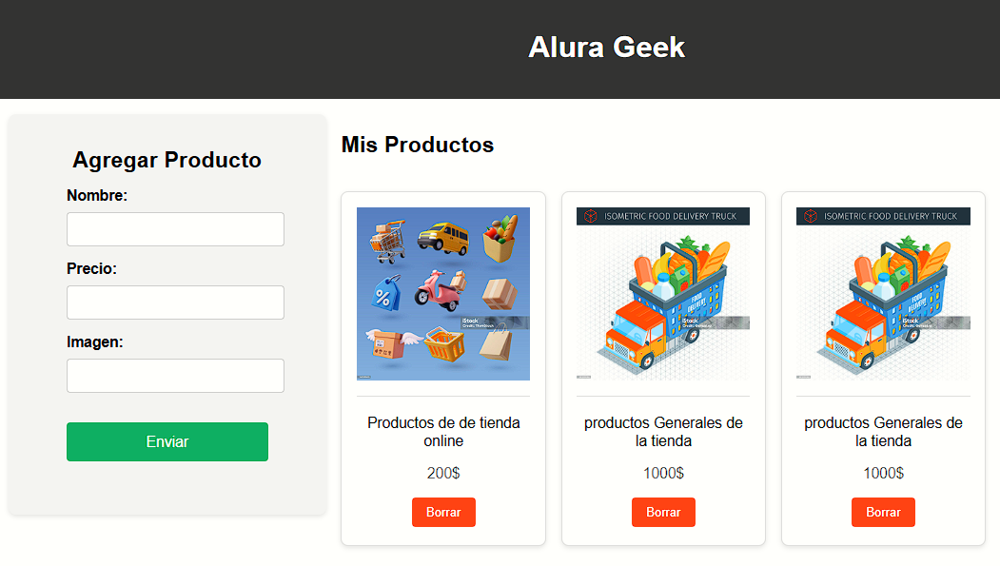
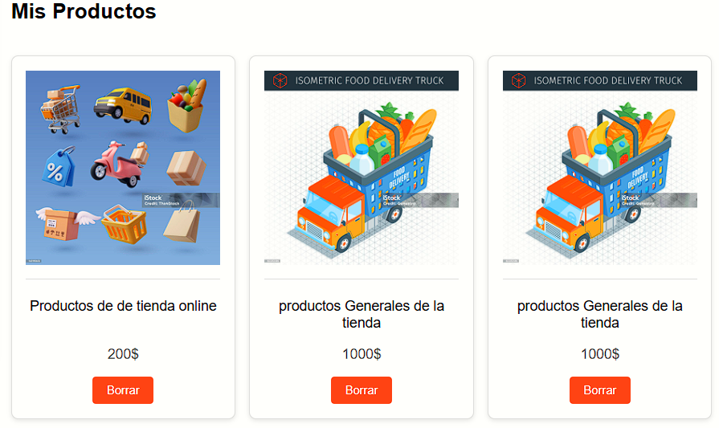

# Alura Geek

Alura Geek es una aplicación de ecommerce que permite a los usuarios gestionar y visualizar productos. Con esta aplicación, puedes agregar, listar y eliminar productos desde una interfaz web fácil de usar.

## Características

- **Agregar Productos:** Permite a los usuarios agregar nuevos productos con nombre, precio e imagen.
- **Listar Productos:** Muestra todos los productos agregados en una lista.
- **Eliminar Productos:** Permite a los usuarios eliminar productos de la lista.

## Capturas de Pantalla

### Formulario para agregar productos


### Lista de productos


## Requisitos

- **Node.js** (versión 12 o superior)
- **npm** (versión 6 o superior)

## Instalación

### 1. Clonar el Repositorio

Primero, clona el repositorio a tu máquina local usando el siguiente comando:

```sh
git clone https://github.com/tu-usuario/alura-geek.git


### Instrucciones Detalladas para Clonar y Ejecutar

1. **Clonar el Repositorio:**
   - Abre tu terminal o línea de comandos.
   - Navega al directorio donde deseas clonar el proyecto.
   - Ejecuta el comando `git clone https://github.com/tu-usuario/alura-geek.git`.

2. **Navegar al Proyecto:**
   - Usa el comando `cd alura-geek` para cambiar al directorio del proyecto clonado.

3. **Instalar Dependencias:**
   - Ejecuta `npm install` para instalar todas las dependencias necesarias.

4. **Iniciar el Servidor JSON:**
   - En tu terminal, ejecuta `npm run server` para iniciar el servidor JSON. Este servidor se ejecutará en `http://localhost:3001`.

5. **Iniciar el Servidor de Archivos Estáticos:**
   - Abre una nueva terminal.
   - Ejecuta `npm run start` para iniciar el servidor de archivos estáticos. Este servidor se ejecutará en `http://localhost:3000`.

6. **Abrir la Aplicación:**
   - Abre tu navegador web.
   - Navega a `http://localhost:3000` para ver y usar la aplicación Alura Geek.

